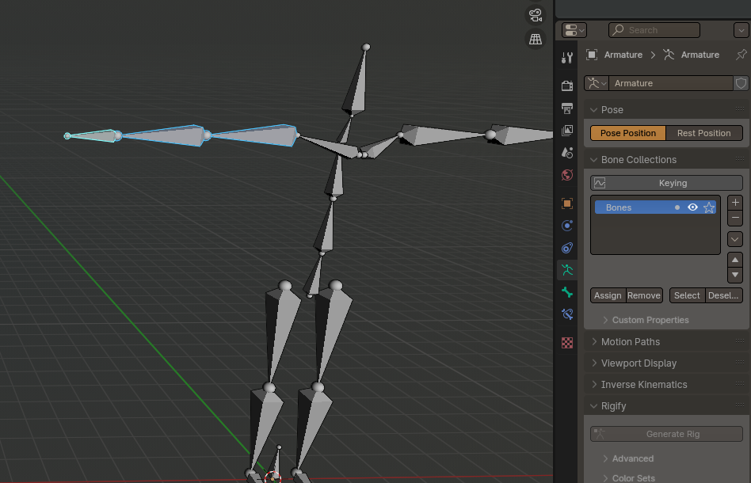
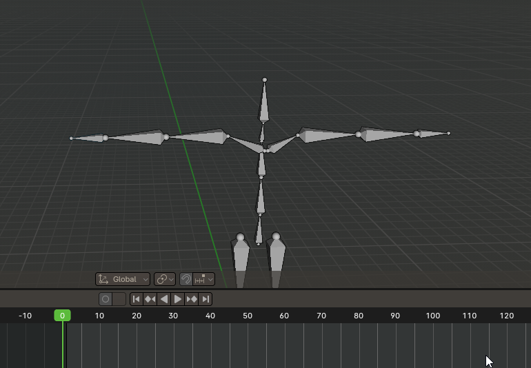
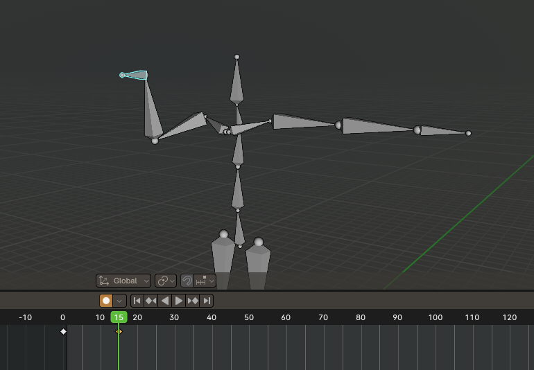
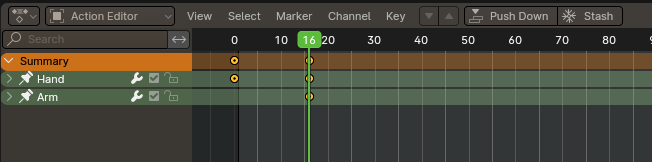

# Keying Bone Collection

ボーンコレクション単位でアニメーションさせるBlenderアドオンです

3dsMaxのBipedみたいに複数ボーンを一括してキー管理できないかな～って思ってとりあえず作った雑なもの  

## 使い方

1. ボーンコレクションパネルに**Keying**ってチェックボタンが出来るので一緒にキー設定したいボーンをまとめてからチェックをつけます  

2. **Auto Keying**にしてアニメーションさせると同ボーングループのボーンが全てキー設定されます  
※Auto Keying 状態にしないとアドオンも動きません

3. キーを消したいときはTimeLineから消したら一緒に消えます

オペレーションのログを監視してボーン変形っぽいことしてたらグループの他のボーンにもキーを挿入するっていうめちゃくちゃ力技な原理で動いています
なのでそれ以外の方法でキー挿入されると反応出来ないです
  
  
また、アニメーションカーブのグループもボーングループ名で勝手にまとめます  

  
そしてDopesheetに表示されるアニメーションは**Only Show Selected**をオンにしていると選択ボーンのキーフレームだけになってしまうため、選択中のボーンのボーングループ内のアニメーションカーブもすべてピン留めします  

 [https://odonata.xyz/](https://odonata.xyz/)